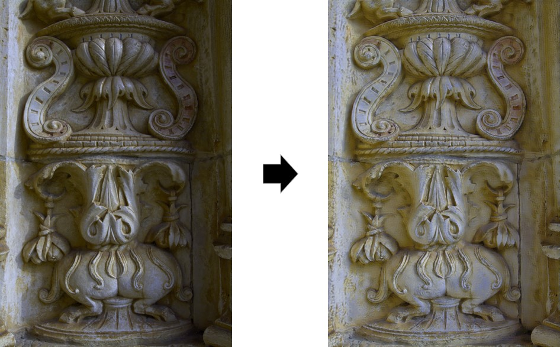
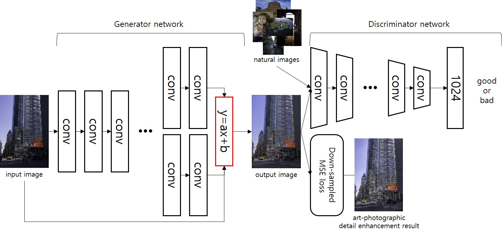

# HDRstyle-Brightness-Enhance

Tensorflow implementation for learning an image-to-image color enhancement using GAN structure (semi-supervised).

For image example:


Network structure looks:


This repository contains train and test codes for reproduce.
However, a description for training will be updated later.

--------------------------

## Prerequisites
- tensorflow r1.2 or higher
- numpy 1.13.1
- scipy 0.19.1
- pillow 4.2.1

## Getting Started
### Installation
- Install tensorflow from https://github.com/tensorflow/tensorflow
- Clone this repo:
```bash
git clone https://github.com/gudtjr8462/HDRstyle-brightness-enhance
cd HDRstyle-brightness-enhance
```

## Test Details
```bash
CUDA_VISIBLE_DEVICES=0 python main.py --input=/path/to/data/input_name  --mode=test
```
